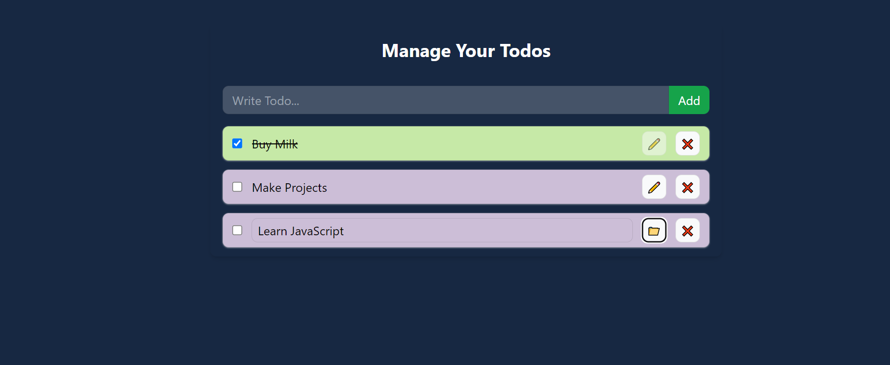

# React Todo List App

A simple Todo List app built with Vite and React. Manage todos with add, update, delete, and complete functions. Uses local storage for persistence.

## Components and Context

- **App.jsx**: Main component with todo management context.
- **TodoForm.jsx**: Component for adding new todos.
- **TodoItem.jsx**: Component for displaying individual todo items.
- **contexts/TodoProvider.jsx**: Context provider for todo state and functions.

## State and Functions

- `todos`: State array holding todos.
- `addTodo`: Adds a new todo.
- `updateTodo`: Updates an existing todo.
- `deleteTodo`: Deletes a todo.
- `toggleComplete`: Toggles completion status.

## Local Storage

Uses `localStorage` to persist todos.

## Styling

Styled with Tailwind CSS for a clean, dark-themed design.

## Usage

1. Install dependencies: `npm install`
2. Start development server: `npm run dev`
3. View at [https://cheerful-tartufo-35cf2c.netlify.app/](https://cheerful-tartufo-35cf2c.netlify.app/)

## Snapshot

Explore and customize the code as needed.
